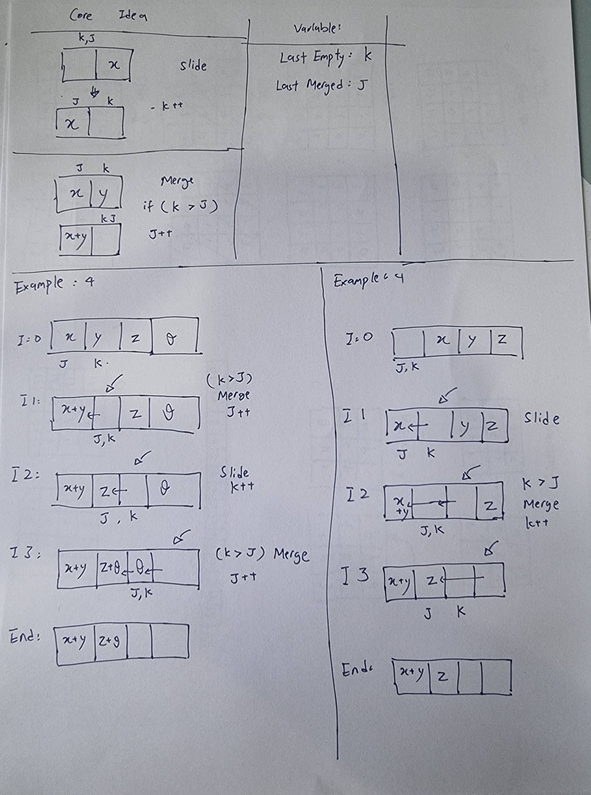

# demo 2048

A simple demo on how to create 2048-liked game using Flutter

To be improved:
Animation is not included in this demo
Gesture detector optimization is needed

## Game rules:

Winning Condition: Reaching 2048
Losing condition: No more move can be made

Mechanism:
- Sliding (left/right/up/down) the block will either slide or merge together
- A block can be merged only once during a slide
- min(2, empty spaces) blocks will be spawned at random position after each slide
- additional rules: Only same value block can be merged

## Game core implementation idea (images):
- Main idea 

images dont include (but they are included in code):
* same value block merge logic
* logic for no more move
